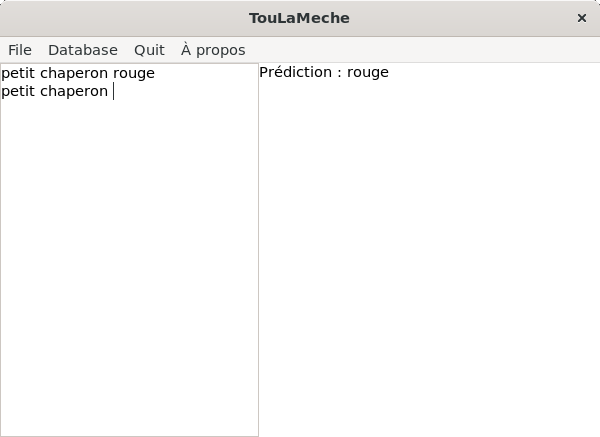
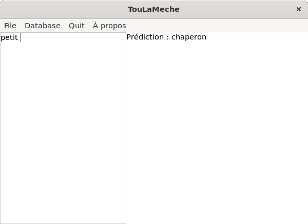

# TouLaMeche

## Description

Ce projet consiste à développer un logiciel capable de prédire le mot suivant dans un texte saisi par un utilisateur.  
La prédiction repose sur une base de données qui enregistre les séquences de mots rencontrées précédemment et leur fréquence d'apparition. Cette base de données s'enrichit dynamiquement à mesure que de nouveaux textes sont saisis.

## Installation

1. Clonez le dépôt :
   ```bash
   git clone https://github.com/ouiUnderscore/TouLaMeche.git
   cd TouLaMeche
   ```
2. Compilez le projet (si applicable) :
   ```bash
   make
   ```
3. Lancez l'applation
   ```
   ./TouLaMeche
   ```

*Il est possible de faire `make clean` pour supprimer les fichiers `.o`*

## Mises à jour

- Création de l'interface graphique via Glade 3.
- Ajout de fonctionnalités :
  - **Écriture de contenu** : Les mots saisis par l'utilisateur sont automatiquement ajoutés à l'arbre de prédiction.
  - **Prédiction du prochain mot** : Le programme suggère le mot suivant le plus probable grâce à l'arbre.
  - **Sauvegarde et ouverture de fichiers texte** : Il est possible de sauvegarder et de charger le contenu du texte d'entrée dans des fichiers au format `.txt`.
  - **Sauvegarde et ouverture de bases de données** : Il est également possible d'ouvrir et sauvegarder des bases de données stockant l'arbre de prédiction au format propriétaire `.tlmdb`.

## Fonctionnement



Lorsque l'on sauvegarde :

```
[
	
	[
		
		[
			
			[
				[ p=1 --> petit ]
			]
		]
		[
			petit
			[
				[ p=1 --> chaperon ]
			]
		]
	]
	[
		petit
		[
			chaperon
			[
				[ p=1 --> rouge ]
			]
		]
	]
	[
		chaperon
		[
			rouge
			[
				[ p=1 --> petit ]
			]
		]
	]
	[
		rouge
		[
			petit
			[
				[ p=1 --> chaperon ]
			]
		]
	]
]
```

Il est également possible de charger une base de données. Pour l'exemple nous allons charger la base de donnée ci-dessus :



Inutile de démontrer les fonctionnalités d'ouverture et de sauvegarde du texte d'entrée (partie gauche de l'application). Elles sont très simples.

## Auteur

Sujet par Stéphane Rubini.

Développé par Emilie Zammit.